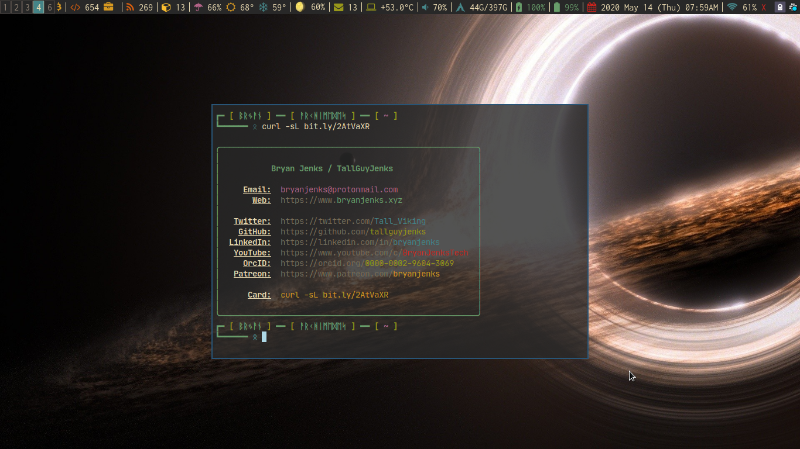

<div align="center">
  
# A cURLable business card

> “If it’s not cURLable, it’s not on the web.” - Vint Cerf



</div>

---

### Usage:

```bash
curl -sL bit.ly/2AtVaXR
```

## Contribute

Contributions are always welcome!

## License

[](https://opensource.org/licenses/MIT)
This program is released under the MIT license, which you can find in the file [LICENSE](LICENSE).
